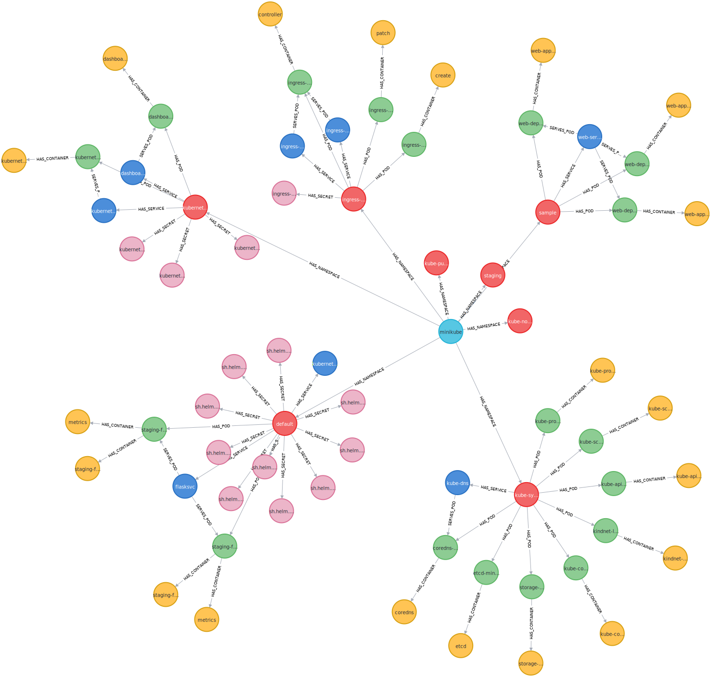
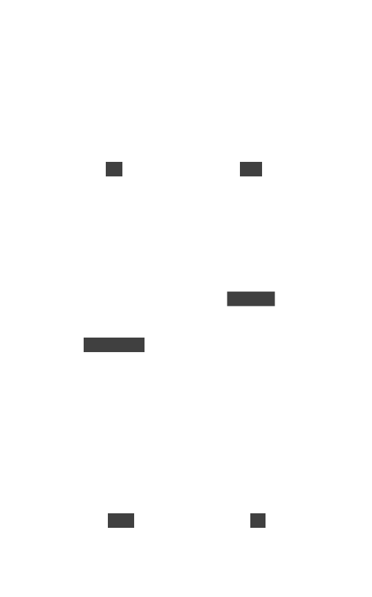
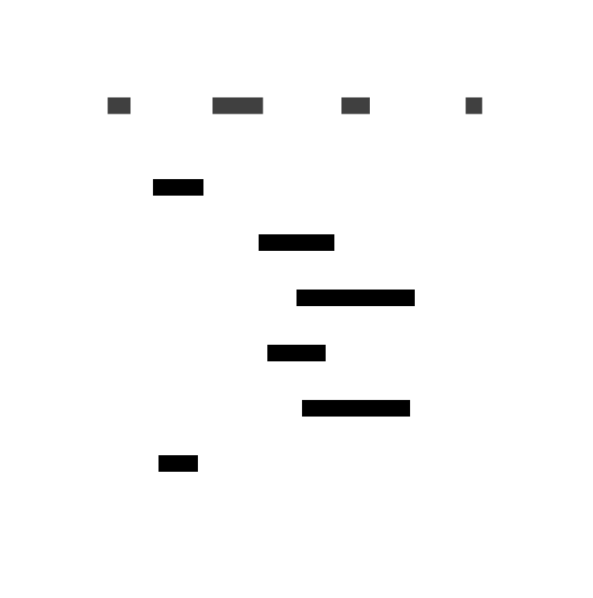

# Infrastructure overview based on requests generated by LLM

## Table of Contents

- [About](#about)
- [Install](#install)
- [Usage](#usage)
- [Diagram](#diagramm)
- [Dasboard](#dashborad)


## About <a name = "about"></a>

Целью работы является получение ответов от LLM об инфраструктуре

Используемые инструменты:
```
- Minikube - кластер кубернетеса с одним узлом
- Cartography - инструмент, который читает конфигурацию инфраструктуры, преобразуя ее в узлы и связи векторной базы данных
- Neo4j - векторная бд
- LLM - Large Language Model
- Python + Langchain
```
## Install <a name = "install"></a>

- Установить Cartography
```pip install cartography```  

- Запустить Neo4J
```
docker run \
    --publish=7474:7474 --publish=7687:7687 \
    --volume=/opt/hw/final/data:/data \
    --volume=/opt/hw/final/logs:/logs \
    --env=NEO4J_AUTH=none \
    neo4j:5.14.0
```
- Прочитать конфигурацию кубернетеса и сохранить ее в Neo4J
```
cartography --neo4j-uri bolt://localhost:7687 --k8s-kubeconfig ~/.kube/config
```
#### В результате мы получаем граф сущностей k8s в Neo4J


- Установим LLM в ввиде Ollama - это менеджер lama моделей https://github.com/jmorganca/ollama
- Установим второй инструмент для использования LLM text-generation-webui - https://github.com/oobabooga/text-generation-webui
- Необходимо установить библиотеки langchain, openai, neo4j, prometheus_client для python, чтобы использовать api для llm

## Diagram <a name = "diagram"></a>

### Диаграмма компонентов



### Диаграмма взаимодействия




## Usage <a name = "usage"></a>

./query_ollama.py <br>
[_Лог запуска скрипта тестирования ollama моделей_](./assets/ollama-models-tests.log)

./query_openai.pi


## Dashboard <a name = "dashborad"></a>

Результаты тестирования моделей

<image src="./assets/grafana-ollama.png" alt="Дашборд тестирования Ollama моделей">